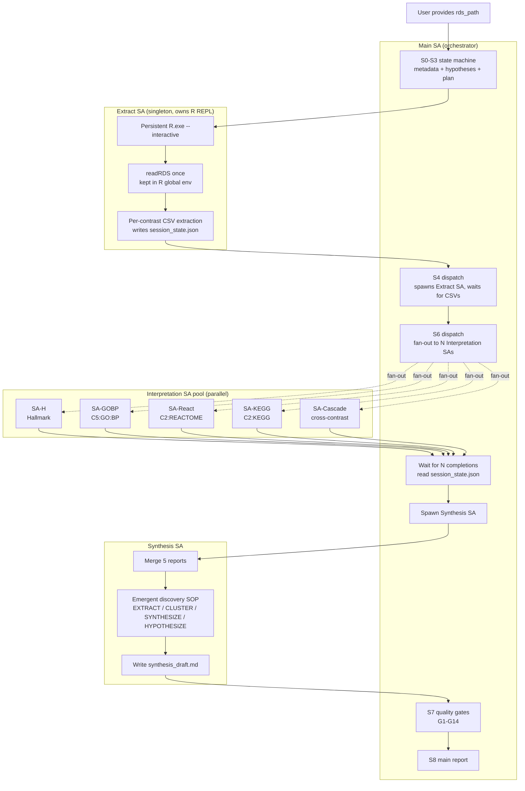

# Multi-SA Parallel Architecture (v0.6 Design)

> Status: **Design / POC target for v0.6.2**. Not implemented yet.
> This document specifies the target architecture so v0.6.0 (clusterProfiler
> first-class) and v0.6.1 (tests) can be built in a way that is compatible
> with the eventual parallel dispatch model.

## Motivation

Today gsea-explorer runs as a single stateful agent that walks S0 → S8
sequentially. Three pain points motivate the move to multi-SA:

1. **R REPL reload waste**. Each `Rscript` invocation re-reads the RDS. A 141 MB
   Capsule costs ~5 s per load; a multi-contrast analysis currently reloads
   it 4-8 times.
2. **Sequential interpretation latency**. Five collections (H / C5:GO:BP /
   C2:REACTOME / C2:KEGG / cross-contrast cascade) are interpreted one after
   another, when they are independent and could run in parallel.
3. **Context window pressure**. Stuffing every collection's top-50 pathways
   plus leading edges plus MSigDB briefs into one SA's context forces
   truncation and degrades interpretation quality.

The fix is a **fan-out / fan-in** pattern: a thin orchestrator SA holds the
global state machine, N leaf SAs do the per-collection work in parallel, and
a synthesis SA merges their outputs.

## Architecture



## Component contracts

### Main SA (orchestrator)

- **Holds**: the state machine (S0-S8), `metadata.json`, `plan.md`, audit log
- **Does NOT hold**: R REPL, large in-memory data frames
- **Responsibilities**:
  1. Run S0-S3 (metadata collection, hypothesis generation, plan confirmation)
  2. Spawn Extract SA, hand it the rds_path, wait for the done signal
  3. Fan out N Interpretation SAs in parallel (one per collection)
  4. Wait for all N to write their per-collection report + `.done.flag`
  5. Spawn Synthesis SA with pointers to the N reports
  6. Run G1-G14 quality gates on the synthesis draft
  7. Write the final main report

### Extract SA (singleton, owns the R REPL)

- **Holds**: the only R REPL in the whole system (`R.exe --interactive`)
- **Lifecycle**: spawned once at S4, kept alive until S8 finishes
- **Responsibilities**:
  1. `readRDS(rds_path)` once into the R global env
  2. Per-contrast, per-collection CSV extraction (all subcollections, no top-N)
  3. Write `session_state.json` containing:
     - `r_terminal_id` (so other SAs can query the same R session)
     - `rds_path`, `platform`, `contrasts`, `geneset_info`
     - Per-contrast significant counts (quick summary)
  4. On follow-up queries from Interpretation SAs (e.g. "give me leading-edge
     genes for pathway X in contrast Y"), service them via the shared
     `r_terminal_id`
- **Key invariant**: never calls `Rscript` one-shot. All R work goes through
  the persistent REPL.

### Interpretation SA pool (parallel)

Each Interpretation SA:

- **Input**: `session_state.json` (with `r_terminal_id`), one collection
  assignment, the user's `metadata.json` and `plan.md`
- **Capabilities**:
  - Read its assigned CSVs directly (no R needed for this)
  - Query the shared R REPL via `send_to_terminal(r_terminal_id, ...)`
    for any on-the-fly computation (e.g. re-ranking by |NES| within a subtheme)
  - Call optional knowledge skills (MSigDB MCP, Reactome, QuickGO) with
    rate-limit-aware retry
- **Output**: `{collection}_report.md` + `{collection}.done.flag`
- **Failure handling**: writes `{collection}.failed.flag` with reason; Main SA
  treats as best-effort (cascade is mandatory, others are optional)

### Synthesis SA

- **Input**: N per-collection reports + `metadata.json`
- **Responsibilities**:
  1. Merge per-collection findings into cross-collection themes
  2. Run the emergent discovery SOP (§3a EXTRACT / CLUSTER / SYNTHESIZE /
     HYPOTHESIZE)
  3. Cross-reference themes against MSigDB brief metadata
  4. Write `synthesis_draft.md`
- **Does NOT**: re-extract data, call R, or override per-collection verdicts

## Shared state protocol

```json
// {out_dir}/session_state.json
{
  "rds_path": "<user-provided>",
  "platform": "gsealens",
  "r_terminal_id": "<uuid from run_in_terminal>",
  "contrasts": ["TreatmentA_vs_Control", "TreatmentB_vs_Control"],
  "geneset_info": {
    "used_collections": ["H", "C2:CGP", "C2:CP:REACTOME", "C5:GO:BP", "..."],
    "total_pathways": 35361
  },
  "per_contrast_summary": {
    "TreatmentA_vs_Control": {
      "total": 1502, "significant_fdr05": 487, "sig_pos": 223, "sig_neg": 264
    }
  },
  "collection_assignments": {
    "SA-H": "H",
    "SA-GOBP": "C5:GO:BP",
    "SA-React": "C2:CP:REACTOME",
    "SA-KEGG": "C2:CP:KEGG_(LEGACY|MEDICUS)",
    "SA-Cascade": "CROSS_CONTRAST"
  },
  "sa_pool_status": {
    "SA-H": { "status": "running", "started_at": "...", "done_flag": null },
    "SA-GOBP": { "status": "pending", "started_at": null, "done_flag": null }
  }
}
```

Each SA reads this file at start, writes only its own status slot, and never
overwrites another SA's slot. File-level locking is not required because each
SA mutates a distinct JSON key.

## R REPL sharing mechanism

The critical innovation is letting multiple SAs query the same R session
without re-loading the RDS.

```mermaid
sequenceDiagram
    participant Main as Main SA
    participant Extract as Extract SA
    participant R as R REPL (terminal_id=T1)
    participant IntH as Interpretation SA-H
    participant IntGOBP as Interpretation SA-GOBP

    Main->>Extract: spawn(rds_path)
    Extract->>R: R.exe --interactive (capture T1)
    Extract->>R: x <- readRDS("<rds_path>")
    Extract->>Main: session_state.json {r_terminal_id: T1}
    Main->>IntH: spawn(collection=H, terminal_id=T1)
    Main->>IntGOBP: spawn(collection=C5:GO:BP, terminal_id=T1)
    par Parallel queries
        IntH->>R: send_to_terminal(T1, "df <- x$results$[['C1']]$data@result; ...")
        IntGOBP->>R: send_to_terminal(T1, "df <- x$results$[['C1']]$data@result; ...")
    end
    R-->>IntH: query result
    R-->>IntGOBP: query result
```

### Concurrency caveat

The R REPL is single-threaded. Concurrent `send_to_terminal` calls will
interleave their output. The protocol requires each Interpretation SA to:

1. Wrap queries in a unique marker: `cat('<<<SA-H-START>>>\n'); <code>;
   cat('<<<SA-H-END>>>\n')`
2. Read terminal output and extract only the content between its own markers
3. Retry once if the output block looks corrupted (contains another SA's
   marker)

For v0.6.2 POC, a simpler alternative is to have each Interpretation SA read
**only pre-extracted CSVs** (no live R queries), and only the Synthesis SA is
allowed to call the shared R REPL for follow-up. This avoids the interleaving
problem entirely at the cost of less dynamic queries.

## Failure modes and handling

| Failure | Detection | Recovery |
|---|---|---|
| Extract SA crash before `session_state.json` written | Main SA timeout (60s) | Main SA re-spawns Extract SA once; second failure → abort S4 |
| Extract SA crash after R REPL started but before CSVs done | Partial `session_state.json` | Main SA re-spawns with resume hint; Extract SA detects existing R env via marker, skips `readRDS` |
| Interpretation SA timeout (no `.done.flag` in 300s) | Main SA poll | Main SA marks collection as "skipped", continues with remaining; quality gate G15 reports skipped collections |
| Interpretation SA writes `.failed.flag` | Main SA reads flag | Same as timeout — skip, continue, report in G15 |
| Synthesis SA crash | No `synthesis_draft.md` after timeout | Main SA re-spawns once; second failure → human intervention |
| R REPL wedged (no output to `send_to_terminal`) | Read returns empty after 30s | Extract SA kills REPL, re-starts fresh, re-reads RDS; writes new `r_terminal_id` to `session_state.json`; in-flight Interpretation SAs must re-read the file on next query |

## What changes in SKILL.md

The methodology in `SKILL.md` is largely preserved; the change is in
**execution**, not interpretation. Concrete edits required for v0.6.2:

1. **§1 R execution protocol**: replace the implicit "agent holds the REPL"
   with "Extract SA holds the REPL; other SAs borrow via `r_terminal_id`".
2. **§2b Cross-contrast**: split into two phases — (a) data prep (Extract SA),
   (b) interpretation (dedicated SA-Cascade in the pool).
3. **§3a Emergent discovery**: explicitly assign the 4-step SOP to the
   Synthesis SA, not the Main SA.
4. **New §7 Multi-SA contract**: codify the `session_state.json` schema, the
   `.done.flag` / `.failed.flag` protocol, and the R REPL sharing rules.
5. **Quality gates**: add G15 (parallel SA completeness — reports any skipped
   collections) and G16 (R REPL sharing sanity — verifies that
   `session_state.json` `r_terminal_id` was used, not ad-hoc new REPLs).

## POC acceptance criteria (v0.6.2)

The POC is considered successful if, against the synthetic test capsule:

1. Extract SA reads the RDS exactly **once** across the whole run (audited in
   `audit.jsonl`).
2. All 5 Interpretation SAs complete within 2× the time of the slowest single
   one (i.e. parallel speedup ≥ 2.5×).
3. `session_state.json` is well-formed and every SA's status slot is
   populated.
4. The synthesis report passes G1-G3 without manual retry.
5. No SA creates its own `R.exe` process (verified by counting R processes —
   must be exactly 1).

## Compatibility with v0.5.5

v0.5.5 behaviour (single SA, sequential, owns the R REPL) remains the
**default fallback**. The multi-SA path is activated by:

- An explicit user opt-in ("parallel mode" / "deep mode"), OR
- Heuristic: RDS size > 50 MB AND ≥ 3 contrasts AND ≥ 4 collections

If any prerequisite for multi-SA is missing (e.g. `runSubagent` unavailable in
the host runtime), the agent transparently falls back to the v0.5.5 sequential
mode and notes it in the audit log.

## Open questions

- [ ] Should the Synthesis SA have access to the R REPL, or only to the
      per-collection reports? Current proposal: reports only, to avoid R
      single-thread contention.
- [ ] How to handle a user adding a contrast mid-run? Proposal: out of scope
      for v0.6; user must restart.
- [ ] Should there be a "lite" mode with only SA-H + SA-Cascade (no GOBP /
      Reactome / KEGG)? Useful for quick exploratory passes.
